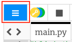
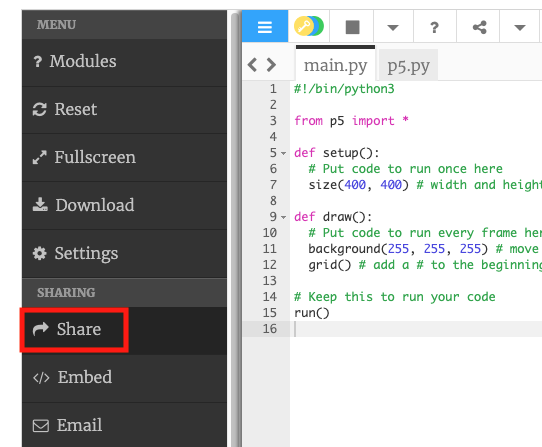
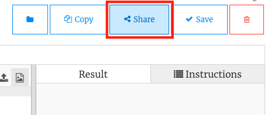
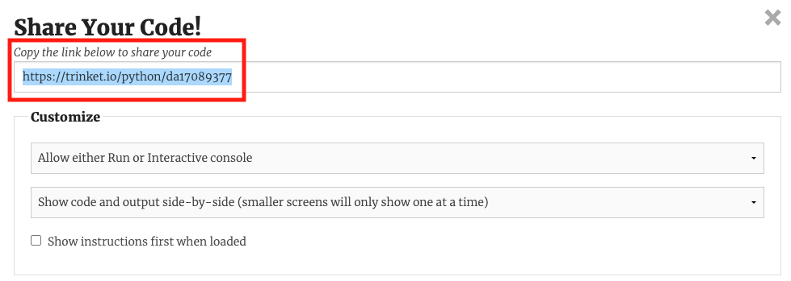

If you are in a club, why not share your project with friends?

You could also show your family how your project works by sending them a link.

Please make sure that you **do not** share any personal information about yourself when sharing your projects.

**Tip:** You don't need a Trinket account to share your project.

Click on the menu icon in the top-left of the Trinket editor:

A pop out menu will appear on the left hand side. Click on the **Share** option:

--- collapse ---
---
title: I can't see a Share option
---

If you do not see a Share option in this menu. 
1. Close the pop out menu by clicking anywhere in the Trinket editor
2. Click on the **Share** button in the top-right of the editor 

--- /collapse ---

A 'Share your code' window will appear with the link to your project in the **Link** box. Copy this link to your clipboard:

Tip: You can share a link to your project even if you don’t have a Trinket account; however, without an account, the link to your project will change each time you update it. If you have shared the link with someone, you will need to send a new link for them to see the changes.